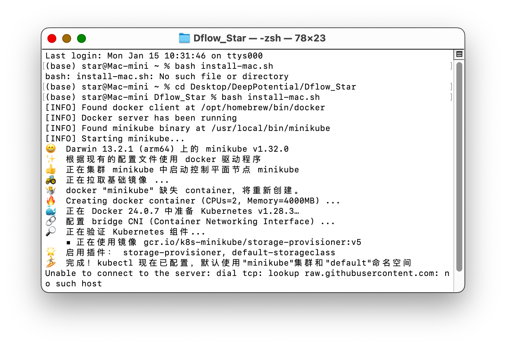
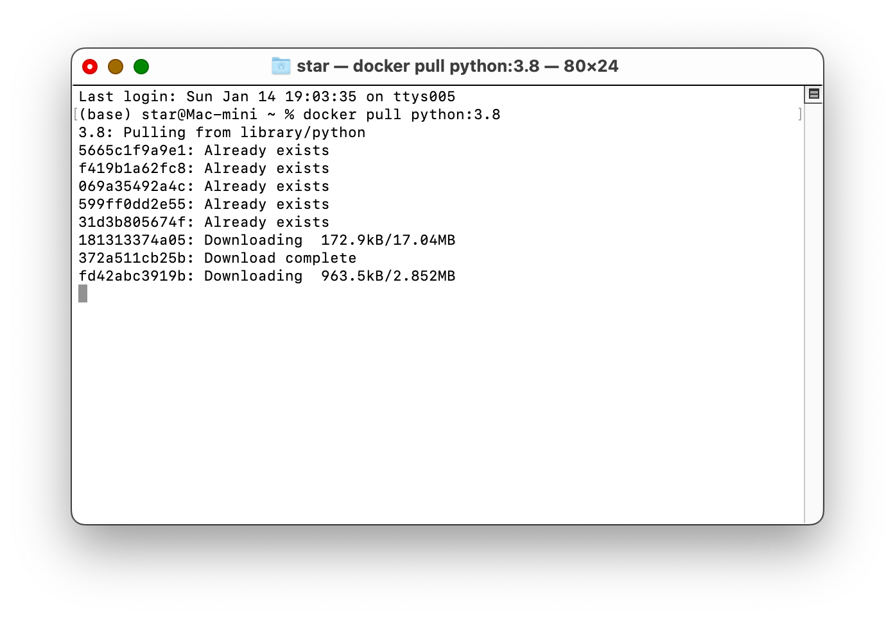

# 快速上手: AI模型预测分子活性（基于Dflow工作流套件）

该文档亦有jupyter notebook交互版: [Dflow_Star_演示笔记.ipynb](Dflow_Star_演示笔记.ipynb.zip) , 欢迎查阅！

## 目录
  * [预配置](#prerequisite)
  * [快速设置 (MacOS)](#quick-setup-macos)
  * [Hello World 示例](#hello-world-example)
    * [基于ShellOPTemplate](#hello-world-example-1-基于shelloptemplate)
    * [基于PythonOPTemplate](#hello-world-example-2-基于pythonoptemplate)
  * [Docker镜像-工作流内部环境新手指南](#docker镜像-工作流内部环境新手指南)
  * [XgBoost预测小分子活性 (基于Dflow工作流套件PythonOPTemplate)](#xgboost预测小分子活性-基于dflow工作流套件pythonoptemplate)
* [使用Dflow进行AI模型预测的优势](#使用dflow进行ai模型预测的优势)
* [对Dflow的思考和建议](#对dflow的思考和建议)


## Prerequisite
1. 预装Anaconda3
2. 预置海外节点（此处感谢纽约大学的海外节点及计算资源）
3. 下载文件: 
- 快速Setup脚本
    - install-linux.sh 或 
    - install-mac.sh
- Hello World 快速入门notebook
    - 基于ShellOPTemplate
    - 基于PythonOPTemplate
    - 四步入门AI模型预测分子活性

## Quick Setup (MacOS)
Note: 每一次开机后都需要进行一次Setup过程。配置完毕后方可多次提交工作流。


```python
import platform
import subprocess
```

### Detect os env


```python
def detect_os():
    os_name = platform.system()
    if os_name in ["Darwin","Linux"]:
        return os_name
    else:
        return "Unknown OS"
```


```python
os_name = detect_os()
print(os_name)
```

    Darwin


### Bash setup script


```python
def setup_dflow(os_name, os_env="notebook"):
    """
    Executes an installation script based on the provided operating system name.
    """
    # Setting the script path based on the operating system
    if os_name == "Darwin":
        script_path = "install-mac.sh"
    elif os_name == "Linux":
        script_path = "install-linux.sh"
    else:
        return "Unsupported OS for this operation"

    # Executing the script
    try:
        if os_env != "notebook":
            result = subprocess.run(['bash', script_path], check=True, stdout=subprocess.PIPE, stderr=subprocess.PIPE)
            return result.stdout.decode('utf-8')
        else:
            get_ipython().system(f'bash {script_path}')
            return "Done."
    except subprocess.CalledProcessError as e:
        return f"An error occurred: {e.stderr.decode('utf-8')}"
```


```python
# Example usage:
output = setup_dflow(os_name)
print(output)
```
过程可能显示如图:



显示如下字样即表示成功：

    [INFO] Found docker client at /opt/homebrew/bin/docker
    [INFO] Docker server has been running
    [INFO] Found minikube binary at /usr/local/bin/minikube
    [INFO] Minikube has been started
    [INFO] argo-server has been ready...
    [INFO] minio has been ready...
    [INFO] postgres has been ready...
    [INFO] workflow-controller has been ready...
    [INFO] Forwarding argo-server:2746 to localhost:2746
    appending output to nohup.out
    [INFO] Forwarding minio:9000 to localhost:9000
    appending output to nohup.out
    [INFO] Forwarding minio:9001 to localhost:9001
    appending output to nohup.out
    [INFO] dflow server has been installed successfully!


## Hello world Example 1: 基于ShellOPTemplate
```python
from dflow import (
    ShellOPTemplate,
    upload_artifact,
    InputParameter, InputArtifact,
    OutputParameter, OutputArtifact,
    Step,
    Workflow
    )
```

```python
art = upload_artifact("foo.txt")
```

```python
step1_templ = ShellOPTemplate(
    name="Hello",
    image="alpine:latest",
    script="echo {{inputs.parameters.msg}} > /tmp/msg.txt && echo {{inputs.parameters.number}} > /tmp/results.txt",
)
step1_templ.inputs.parameters = {
    "msg": InputParameter(),
    "number": InputParameter(),
}
step1_templ.inputs.artifacts = {
    "in_art": InputArtifact()
}
step1_templ.outputs.parameters = {
    "out_param": OutputParameter(value_from_path="/tmp/results.txt")
}
step1_templ.outputs.artifacts = {
    "out_art": OutputArtifact(path="/tmp/msg.txt")
}
```

```python
step2_templ = ShellOPTemplate(
    name="Duplicate",
    image="alpine:latest",
    script="cat /tmp/foo.txt /tmp/foo.txt > /tmp/bar.txt && echo $(({{inputs.parameters.number}}*2)) > /tmp/results.txt",
)
step2_templ.inputs.artifacts = {
    "in_art":InputArtifact(path="/tmp/foo.txt")
    }
step2_templ.inputs.parameters = {
    "number": InputParameter(),
    }
step2_templ.outputs.artifacts = {
    "out_art": OutputArtifact(path="/tmp/bar.txt")
    }
step2_templ.outputs.parameters = {
    "out_param": OutputParameter(value_from_path="/tmp/results.txt")
    }
```

```python
step1 = Step(
    name="step1",
    template=step1_templ,
    parameters={
        "msg":"HelloWorld!",
        "number": 1,
        },
    artifacts={"in_art": art}
    )
step2 = Step(
    name="step2",
    template=step2_templ,
    parameters={"number":step1.outputs.parameters["out_param"]},
    artifacts={"in_art":step1.outputs.artifacts["out_art"]},
    )
```

```python
wf = Workflow(name="helloworld")
wf.add(step1)
wf.add(step2)
import urllib3
urllib3.disable_warnings(urllib3.exceptions.InsecureRequestWarning)
wf.submit()
```

    Workflow has been submitted (ID: helloworld-9cbv7, UID: b87fb710-a99d-4722-abb4-8f1158130757)
    Workflow link: https://127.0.0.1:2746/workflows/argo/helloworld-9cbv7


## Hello world example 2: 基于PythonOPTemplate
```python
from pathlib import Path

from dflow import Step, Workflow
from dflow.python import OP, OPIO, Artifact, OPIOSign, PythonOPTemplate
```

```python
from dflow import upload_artifact
art = upload_artifact("foo.txt")
print(art)
```

    {'access_key': 'admin',
     'bucket_name': 'my-bucket',
     'console': 'http://127.0.0.1:9001',
     'endpoint': '127.0.0.1:9000',
     'extra_prefixes': [],
     'key': 'upload/b3b58b17-3631-4f0b-874a-290effdb1dd9/tmph0a8luu7.tgz',
     'prefix': '',
     'repo': None,
     'repo_key': None,
     'repo_prefix': '',
     'repo_type': 's3',
     'secret_key': 'password',
     'secure': False,
     'slice': None,
     'storage_client': None,
     'urn': ''}


```python
class WriteFile(OP):
    def __init__(self):
        pass

    @classmethod
    def get_input_sign(cls):
        return OPIOSign({
            "msg": str,
            "foo": Artifact(Path)
        })

    @classmethod
    def get_output_sign(cls):
        return OPIOSign({
            "out_art": Artifact(Path),
            "length": int
        })

    @OP.exec_sign_check
    def execute(
            self,
            op_in: OPIO,
    ) -> OPIO:

        op_out = OPIO({
            "out_art": op_in["foo"],
            "length": len(op_in["msg"])
        })
        return op_out
```


```python
class Duplicate(OP):
    def __init__(self):
        pass

    @classmethod
    def get_input_sign(cls):
        return OPIOSign({
            "in_art": Artifact(Path),
            "in_num": int
        })

    @classmethod
    def get_output_sign(cls):
        return OPIOSign({
            "out_art": Artifact(Path),
            "out_num": int,
        })

    @OP.exec_sign_check
    def execute(
            self,
            op_in: OPIO,
    ) -> OPIO:
        with open(op_in["in_art"], "r") as f:
            content = f.read()
        with open("bar.txt", "w") as f:
            f.write(content * 3)

        op_out = OPIO({
            "out_art": Path("bar.py"),
            "out_num": op_in["in_num"] * 2,
        })
        return op_out
```

```python
import sys
step0 = Step(
    name="step0",
    template=PythonOPTemplate(
        WriteFile, 
        image=f"python:{sys.version_info.major}.{sys.version_info.minor}"
        ),
    parameters={"msg": "HelloWorld!"},
    artifacts={"foo":art}
)

step1 = Step(
    name="step1",
    template=PythonOPTemplate(Duplicate, image=f"python:{sys.version_info.major}.{sys.version_info.minor}"),
    parameters={"in_num": step0.outputs.parameters["length"]},
    artifacts={"in_art": step0.outputs.artifacts["out_art"]},
)
wf = Workflow(name="python")
wf.add(step0)
wf.add(step1)
wf.submit()
```

    Workflow has been submitted (ID: python-lccm6, UID: ae5e6d1f-42ed-4656-b705-48449c4f8d7e)
    Workflow link: https://127.0.0.1:2746/workflows/argo/python-lccm6


## Docker镜像-工作流内部环境新手指南
之前的例子功能实现较为简单，没有对其中的配置过多展开。在实际运行过程中，工作环境可能是复杂的、不通用的。
Argo Workflow的每一个step会重启一个独立、隔绝的新环境, 仅仅通过配置本地环境 (ipykernel/conda-env/singularity)是没法设置工作过程中的各种依赖项的。
这一个section来介绍一下新手如何指定、配置工作流的内部环境。

#### 较为简单的工作流环境可以由如下代码进行指定：
- Alphine Linux 轻量环境
```python
    template = ShellOPTemplate(
        name=[str],
        image="alpine:latest",
        script=[str]
        )
```
- Python原生环境 (此处设定版本表示与本地系统保持一致)
```python
    template = PythonOPTemplate(
        [pythom class name], 
        image = f"python:{sys.version_info.major}.{sys.version_info.minor}"
        )
```
- PyTorch 官方镜像
```python
    template = PythonOPTemplate(
        [pythom class name], 
        image = "pytorch/pytorch:latest"
        )
```
- Deepchem 官方镜像 (版本为2.4, 较为古老, 更新较慢, 推荐自行配置较新版本)
```python
    template = PythonOPTemplate(
        [pythom class name], 
        image = "deepchemio/deepchem"
        )
```
#### 个性化自定义配置方法请参考接下来介绍的方法。


### Option 1: Dockerfile配置

适用条件 (符合以下一条或多条): 
- 有现成的 dokerfile + requirements 文档
- 有较为明确的依赖项需求及其版本号
- 依赖项非常多且复杂, 手动逐一安装过于繁琐

#### **配置文件：**
具体例子请参见: [docker_demo](docker_demo)
```
docker_demo
  |- app
    |- app.py
  |- dockerfile
  |- k8service.yml
  |- makefile
  |- requirements.txt
```

### Option 2: 基础镜像上安装其他库

#### Step1: Pull官方基础镜像:
根据需要，安装官方基础镜像。此处给出几个例子：
1. python原生环境 (python:[版本号])
以较为稳定的3.8为例：
```
    docker pull python:3.8
```
2. TensorFlow官方镜像 (tensorflow/tensorflow:[版本号])
```
docker pull tensorflow/tensorflow:latest
```
3. PyTorch官方镜像 (pytorch/pytorch:[版本号])
```
    docker pull pytorch/pytorch:latest
```


显示下载完成后, 可以输入指令检查当前镜像列表:
```
    docker images
```

#### Step 2: 在基础镜像内安装其他库, 或配置依赖项

- 运行基础镜像
以DeePMD-kit为例:
```
    docker run -it python:3.8 /bin/bash
    pip install deepmd-kit[gpu,cu11,lmp,ipi]
```
- 新建一个窗口, 保持旧窗口未关闭且未exit, 输入指令查看`CONTAINER ID`
```
    docker ps -a
```
- 将这个ID填入下列指令, 即可将装入deepmd-kit的镜像保存下来
```
    docker commit [CONTAINER ID] [REPOSITORY]:[TAG]
```

#### Step 3: 将制作好的镜像发布至Dockerhub
- 此步骤需要先登录Dockerhub账号, 新用户需移步 [DockerHub官网](https://hub.docker.com/) 注册
```
    docker login
```
- 将镜像push至Dockerhub
```
    docker tag [CONTAINER ID] [Username]/[Repository]:[Tag]
```
此处`[Tag]`名可以随意自定义

#### 至此，自定义配置的docker镜像就已经配置完成, 可以将发布的image直接在workflow step中调用
例如:
```python
    Step(
        name="setup-and-load",
        template=PythonOPTemplate(
            ExampleClass,
            image="starliu714/python:deepmd",
            python_packages=package_list,
        ),
        artifacts={
            ...
        }
    )
```

## XgBoost预测小分子活性 (基于Dflow工作流套件PythonOPTemplate)
```python
# Infrastructure modules
from dflow import Step, Workflow, upload_artifact
from dflow.python import OP, OPIO, Artifact, OPIOSign, PythonOPTemplate, upload_packages
from pathlib import Path
# Scientific Computing modules
import sys, os, torch
import deepchem as dc
import xgboost as xgb
from deepchem.data import NumpyDataset, DiskDataset
```

### 总体上分为五步: 
- 0 上传smile数据集至worflow环境
- 2 smile转指纹
- 3 指纹数据集正则化
- 3 拟合、训练模型
- 4 预测分子性质/测试模型表现

### Step 0: Load dataset (source: Molnet)
```python
tr_dataset = upload_artifact("trainBBBP.csv")
te_dataset = upload_artifact("testBBBP.csv")
val_dataset = upload_artifact("validBBBP.csv")
```

### Step 1: Setup and Load
```python
class SetupAndLoad(OP):
    def __init__(self):
        pass

    @classmethod
    def get_input_sign(cls):
        return OPIOSign({
            "train_file": Artifact(Path),
            "test_file": Artifact(Path),
            "valid_file": Artifact(Path),
        })

    @classmethod
    def get_output_sign(cls):
        return OPIOSign({
            "train_dataset_dir": Artifact(Path), 
            "test_dataset_dir": Artifact(Path),
            "valid_dataset_dir": Artifact(Path),
        })

    @OP.exec_sign_check
    def execute(self, op_in: OPIO) -> OPIO:
        train_file_path = str(op_in["train_file"])
        test_file_path = str(op_in["test_file"])
        valid_file_path = str(op_in["valid_file"])

        smile_str = 'SMILES'
        loader = dc.data.CSVLoader(
            tasks=['targets'], feature_field=smile_str, 
            featurizer=dc.feat.CircularFingerprint(size=256))

        train_dataset = loader.create_dataset(train_file_path)
        test_dataset = loader.create_dataset(test_file_path)
        valid_dataset = loader.create_dataset(valid_file_path)

        # Use the data_dir attribute to get the directory where the dataset is stored
        op_out = OPIO({
            "train_dataset_dir": Path(train_dataset.data_dir),
            "test_dataset_dir": Path(test_dataset.data_dir),
            "valid_dataset_dir": Path(valid_dataset.data_dir),
        })
        return op_out
```

### Step 2: Transform the Datasets
```python
class TransformData(OP):
    def __init__(self):
        pass

    @classmethod
    def get_input_sign(cls):
        return OPIOSign({
            "train_dataset_dir": Artifact(Path),
            "test_dataset_dir": Artifact(Path),
            "valid_dataset_dir": Artifact(Path),
        })

    @classmethod
    def get_output_sign(cls):
        return OPIOSign({
            "transformed_train_dir": Artifact(Path),
            "transformed_test_dir": Artifact(Path),
            "transformed_valid_dir": Artifact(Path),
        })

    @OP.exec_sign_check
    def execute(self, op_in: OPIO) -> OPIO:
        # Access the dataset paths from the artifacts
        train_dataset_path = str(op_in["train_dataset_dir"])
        test_dataset_path = str(op_in["test_dataset_dir"])
        valid_dataset_path = str(op_in["valid_dataset_dir"])

        # Load datasets
        train_dataset = DiskDataset(train_dataset_path)
        test_dataset = DiskDataset(test_dataset_path)
        valid_dataset = DiskDataset(valid_dataset_path)

        # Apply transformations
        transformer = dc.trans.NormalizationTransformer(transform_y=True, dataset=train_dataset)
        transformed_train = transformer.transform(train_dataset)
        transformed_test = transformer.transform(test_dataset)
        transformed_valid = transformer.transform(valid_dataset)

        # Return the data_dir of transformed datasets as artifacts
        op_out = OPIO({
            "transformed_train_dir": Path(transformed_train.data_dir),
            "transformed_test_dir": Path(transformed_test.data_dir),
            "transformed_valid_dir": Path(transformed_valid.data_dir),
        })
        return op_out
```

### Step 3: Train the model
```python
class TrainModel(OP):
    def __init__(self):
        pass

    @classmethod
    def get_input_sign(cls):
        return OPIOSign({
            "transformed_train": Artifact(Path),
            "transformed_valid": Artifact(Path),
        })

    @classmethod
    def get_output_sign(cls):
        return OPIOSign({
            "model_path": Artifact(Path),
        })

    @OP.exec_sign_check
    def execute(self, op_in: OPIO) -> OPIO:
        # Load transformed datasets from the provided paths
        transformed_train = DiskDataset(op_in["transformed_train"])
        transformed_valid = DiskDataset(op_in["transformed_valid"])

        # Train model
        device = torch.device("cuda" if torch.cuda.is_available() else "cpu")
        xgb_model = xgb.XGBClassifier(
            n_estimators=100, 
            learning_rate=0.1, 
            tree_method='auto' if device.type == 'cuda' else 'hist'
        )
        print("Fitting model...")

        dc_model = dc.models.GBDTModel(xgb_model, mode="classification")
        dc_model.fit_with_eval(transformed_train, transformed_valid)

        # Save the trained model and return its path as an artifact
        model_path = str(os.getcwd())
        dc_model.save(model_path)

        op_out = OPIO({
            "model_path": model_path,
        })
        return op_out
```

### Step 4: Predict and Evaluate
```python
class EvaluateModel(OP):
    def __init__(self):
        pass

    @classmethod
    def get_input_sign(cls):
        return OPIOSign({
            "model": Artifact(Path),
            "transformed_test": Artifact(Path),
        })

    @classmethod
    def get_output_sign(cls):
        return OPIOSign({
            "evaluation_metrics": float,  # AUC score as a float
        })

    @OP.exec_sign_check
    def execute(self, op_in: OPIO) -> OPIO:
        model = op_in["model"]
        test_dataset = op_in["transformed_test"]

        # Assuming the model is a DeepChem model and test_dataset is a DeepChem dataset
        metric = dc.metrics.Metric(dc.metrics.roc_auc_score)
        evaluation_metrics = model.evaluate(test_dataset, [metric])

        # Extract the AUC score from the evaluation metrics
        auc_score = evaluation_metrics["roc_auc_score"]

        op_out = OPIO({
            "evaluation_metrics": auc_score,
        })
        return op_out
```

### Setup Workflow

#### Import src of additional packages
注意: 
1. Numpy必须在docker中预装, 其部分编译后的文件无法通过调用本地源代码获得
2. 建议本地调试环境与Step环境保持一致, 否则容易出现version imcompatible


```python
package_list = [
    # "/Users/star/anaconda3/lib/python3.11/site-packages/deepchem", # deepchem
    # "/Users/star/anaconda3/lib/python3.11/site-packages/xgboost", # xgboost
    # "/Users/star/anaconda3/lib/python3.11/site-packages/pandas", # pandas
    # "/Users/star/anaconda3/lib/python3.11/site-packages/pytz", # pytz
    # "/Users/star/anaconda3/lib/python3.11/site-packages/dateutil", # dateutil
    "/Users/star/anaconda3/lib/python3.11/site-packages/rdkit", # rdkit
]
```

#### Step Setting
```python
# Step 1: Setup and Load Data
step1 = Step(
    name="setup-and-load",
    template=PythonOPTemplate(
        SetupAndLoad,
        image="starliu714/python:deepchem",
        # python_packages=package_list,
    ),
    artifacts={
        "train_file": tr_dataset,
        "test_file": te_dataset,
        "valid_file": val_dataset,
    }
)
# Step 2: Transform Data
step2 = Step(
    name="transform-data",
    template=PythonOPTemplate(
        TransformData,
        image="starliu714/python:deepchem",
    ),
    artifacts={
        "train_dataset_dir": step1.outputs.artifacts["train_dataset_dir"],
        "test_dataset_dir": step1.outputs.artifacts["test_dataset_dir"],
        "valid_dataset_dir": step1.outputs.artifacts["valid_dataset_dir"],
    }
)
# Step 3: Train Model
# It should take the output of step1 as input
step3 = Step(
    name="train-model",
    template=PythonOPTemplate(
        TrainModel,
        image="starliu714/python:deepchem",
    ),
    artifacts={
        "transformed_train": step2.outputs.artifacts["transformed_train_dir"],
        "transformed_valid": step2.outputs.artifacts["transformed_valid_dir"],
    }
)
# Step 4: Evaluate Model
step4 = Step(
    name="evaluate-model",
    template=PythonOPTemplate(
        EvaluateModel,
        image="starliu714/python:deepchem",
        python_packages=package_list,
    ),
    artifacts={
        "model": step3.outputs.artifacts["model_path"],  # Model artifact from step3
        "transformed_test": step2.outputs.artifacts["transformed_test_dir"],  # Test dataset artifact from step2
    }
)
```

#### Create and submit workflow
```python
wf = Workflow(name="xgboost")
wf.add(step1)
wf.add(step2)
wf.add(step3)
wf.add(step4)
wf.submit()
```

提交成功会显示字样:
```
Workflow has been submitted (ID: xgboost-6f6zg, UID: 68c9d900-6405-47de-b0df-6cda841294f4)
Workflow link: https://127.0.0.1:[Port number]/workflows/argo/[Workflow Name]-[Submission ID]
```
直接点击或复制链接至浏览器即可进入Argo Workflow的控制面板(dashboard)进行实时监测。


## 使用Dflow进行AI模型预测的优势：

1. 降低了ArgoCD Workflow的使用门槛
2. 更加复杂的工作流的实现, 例如: DAG、循环工作流
3. 高屋建瓴的视角, 更直观地监测和设计 AI模型、高通量计算/筛选系统
4. 实时监测每一步状态, 中途提取运行过程中的"中间产物"或"副产物"

### 对Dflow的思考和建议：

1. 对Windows的更低门槛的入门教学、技术支持
2. 期待更为完善的使用指南
3. 更多实用案例
4. 更广泛的宣传
